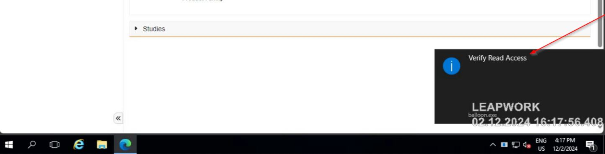

# Balloon Notification Script

This PowerShell script provides a way to display a system tray balloon notification with a customizable title, text, and icon type. It can be used to notify users with brief messages or alerts.

---

## Features

- Display a system tray balloon notification.
- Customize the title, text, and icon (Info, Warning, Error, or None).
- Dynamically extracts the process icon to use in the notification.

---

## Prerequisites

- **PowerShell**: Ensure you are running this script on a system with PowerShell installed.
- **.NET Framework**: The script uses the `System.Windows.Forms` and `System.Drawing` assemblies.

---

## Usage

### Command Syntax

```powershell
.\BalloonNotification.ps1 "SenderName" "Message"
```

### Parameters

1. `SenderName`: The source or origin of the notification.
2. `Message`: The content of the notification to display.

### Example

```powershell
.\BalloonNotification.ps1 "System" "Your operation completed successfully!"
```

This will display a system tray balloon notification with:

- **Title**: "The Notification from System:"
- **Message**: "Your operation completed successfully!"

---

## Function Details



### `ShowBalloonTipInfo`

#### Parameters:
- **Text**: The main message body.
- **Title**: The title of the notification.
- **Icon**: The icon type (`Info`, `Warning`, `Error`, or `None`).

#### Behavior:
1. Ensures the `System.Windows.Forms` assembly is loaded.
2. Creates or reuses a `NotifyIcon` instance.
3. Displays the balloon notification for 1 second (1000ms).

---

## Notes

- Ensure the script is executed with appropriate permissions.
- Notifications will only appear if the system tray is active.

---

## Limitations

- The notification duration is set to 1 second by default. This can be modified in the script by changing the `ShowBalloonTip` parameter.

---

## License

This script is provided as-is with no warranties. Feel free to modify and use it in your projects.
